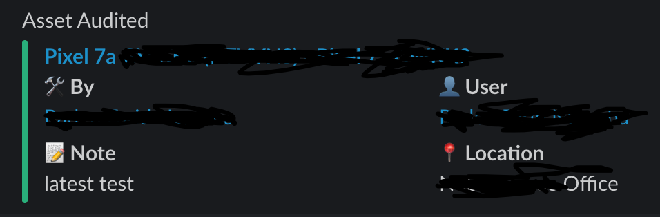

# Customize audit notifikasi
in this file only changes the notification output for audit, added user to the audited asset
the file that is changed is
```AuditNotification.php```
which is in the folder
```app/Notifications```

if you use docker-compose then you only need to mount with this volume file

```yaml

volumes:
- ./script/app/Notifications/AuditNotification.php:/var/www/html/app/Notifications/AuditNotification.php:rw

```

then the output will be like this

