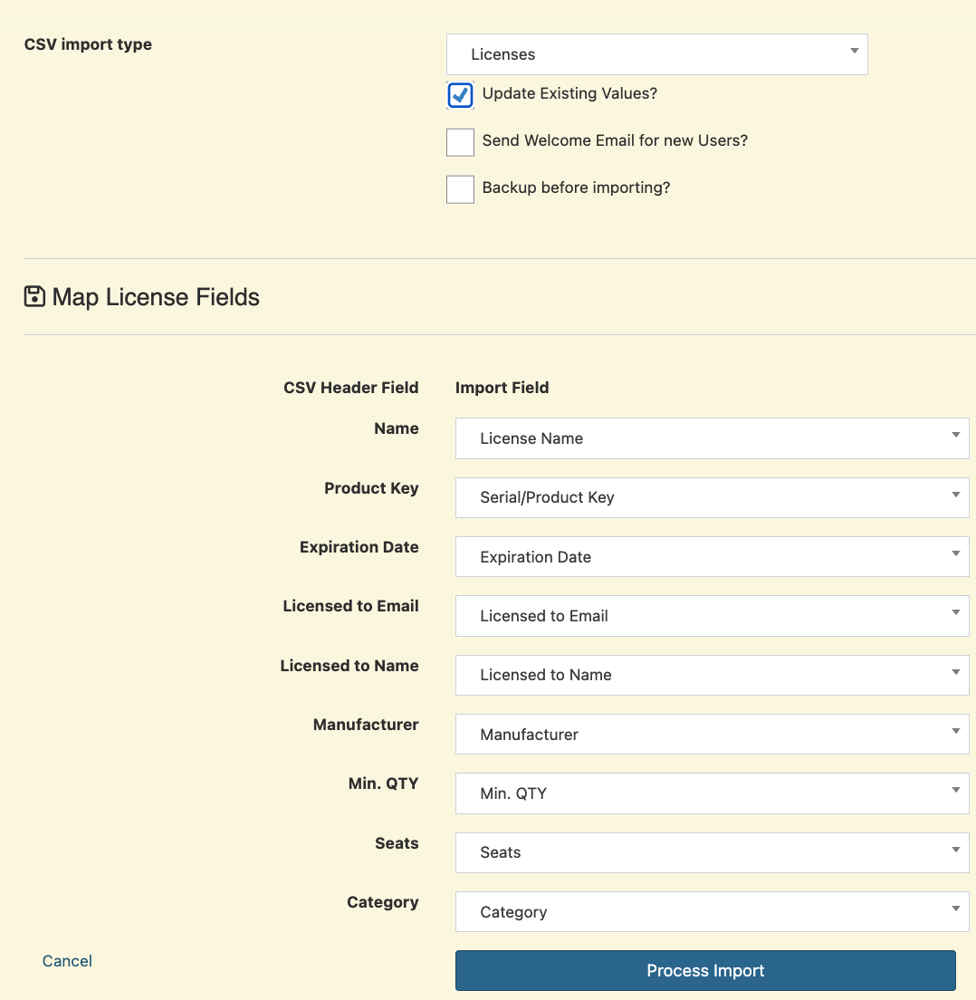

# Setyl to Snipe-it
I use a CSV file so that it can be tracked and so that the data can be changed if necessary. If you use via API and the data has reached thousands of users and assets, there is usually a rate limit and of course it will take time if we have to pause some data.

## Preparation
[optional] if you enter IMEI and mac address data then you need to create a custom field

## Custom Fields

1. Create Fieldsets first, I created 2 Fieldsets:
Computer Fields and Phone Fields

2. Create Custom Fields

   | Custom Fields | Fieldsets                     |
   |---------------|-------------------------------|
   | MAC Address   | Computer Fields, Phone Fields |
   | Computer Name | Computer Fields               |
   | Graphics Card | Computer Fields               |
   | CPU           | Computer Fields, Phone Fields |
   | RAM           | Computer Fields, Phone Fields |
   | Storage Size  | Computer Fields, Phone Fields |
   | Phone Number  | Phone Fields                  |
   | IMEI 1        | Phone Fields                  |
   | IMEI 2        | Phone Fields                  |

    

## Export
Export all users and assets on setyl
1. [Export Assets](https://app.setyl.com/physical_assets/table)

    

2. [Export People](https://app.setyl.com/users/table)

    

    After all are downloaded, enter the csv into the ```files``` folder
    
    

## Before import

install the required requirements
```bash
pip install requests
```


### Migrate User
Run the command

```bash
python 1.migrate_users_to_snipeit.py
```


### Migrate Assets
Run the command

```bash
python 2.migrate_assets_to_snipeit.py
```


## Import
1. Import in the Snip It dashboard


2. then adjust

    Users
    

    Assets
    

## License
Okay, let's move on to License
This stage is actually optional if it is needed, here I try to import a license from a Windows product
- Windows Pro
- Microsoft Office

## Windows Pro
On the previous Windows Pro license, I still manually recorded it with Google Sheet

## Convert file
1. We create a file named windows-pro.txt and contain all the Windows Pro licenses that we have

2. Run the script to convert to a csv file
```bash
python 3.migrate_license_to_snipeit.py
```


3. Import to the snipe-it dashboard


## Mapping Windows licenses to assets
After all Windows Pro licenses have been imported, we need to check the license based on the product key to the asset, a file is required license-windows-map.csv
with contents

```csv
Asset Tag,Product Key
AABBCCDD,ABCDE-EFGHI-JKLMN-OPQRS-TUVWX
```
Then later the windows product key ```ABCDE-EFGHI-JKLMN-OPQRS-TUVWX``` will be checked into the asset tag ```AABBCCDD```

At this stage we just use the API

## Create API Token
Replace
https://example.com with your senipe-it domain

1. Create an API token on the page https://example.com/account/api
2. Name it Import then copy the Token

## Run Script
Run the script ```license-asset-map.py```
```bash
python license-asset-map.py
```


## Microsoft Office

For Microsoft Office that still uses a license key, the same step (number 3) is applied as the previous Windows Pro

1. Create a TXT file containing a collection of product keys
2. Change the script 3.migrate_license_to_snipeit.py

    adjust
    ```python
    input_file = "files/license-office.txt"
    output_file = "converted/license-office.csv"

    # Template Column Snipe-IT License
    # "Seats": 1 Total available seats
    license_template = {
    "Name": "Microsoft Office",
    "Product Key": "",
    "Expiration Date": "",
    "Licensed to Email": "",
    "Licensed to Name": "",
    "Manufacturer": "Microsoft",
    "Min. QTY": "0",
    "Seats": 1,
    "Category": "Misc Software"
    }
    ```
3. Import the converted (csv) file to the dashboard

## Mapping Microsoft Office to assets
1. Create a CSV file containing, Asset tag with the previous product key
2. Change the source of the csv file to ```license-asset-map.py```

    ```python
    CSV_FILE = 'files/license-office-map.csv'
    ```
3. Rerun Script

    ```bash
    license-asset-map.py
    ````